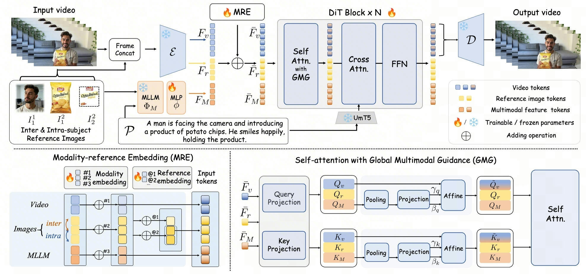

<div align="center">

<p align="center">
  
</p>

<h1>HOMIE: Human-object Centric Video Personalization via Multimodal Intelligent Enhancement</h1>

[Yiyang Cai*](https://yiyangcai.github.io/) · [Nan Chen*](https://cn-makers.github.io/) · Rongchang Xie · Junwen Pan · Chunyang Jiang · Cheng Chen · Wen Zhou · Zhenbang Sun · Wei Xue · [Wenhan Luo](https://whluo.github.io/) · Yike Guo

Hong Kong University of Science and Technology

mailto: ycaicj@connect.ust.hk

<a href='https://yiyangcai.github.io/homie-page.github.io/'></a>
<a href='https://arxiv.org/'></a>
<a href='https://huggingface.co/yychai/homie-r2v-wan2.1'></a>

</div>

TL;DR: HOMIE is a subject-consistent video customization model enhanced by multimodal large language models (MLLMs) that can generate videos with complex human-object combination, including general human-object interaction, abstract content personalization. HOMIE can generate videos with both inter- and intra-subject video generation.

<p align="center">
  
</p>

## Video Demos

<table align="center">
  <tr>
    <td align="center">
      <video src="assets/demo_1.mp4" width="90%" controls autoplay muted loop playsinline></video>
    </td>
    <td align="center">
      <video src="assets/demo_2.mp4" width="90%" controls autoplay muted loop playsinline></video>
    </td>
  </tr>
  <tr>
    <td align="center">
      <video src="assets/demo_3.mp4" width="90%" controls autoplay muted loop playsinline></video>
    </td>
    <td align="center">
      <video src="assets/demo_4.mp4" width="90%" controls autoplay muted loop playsinline></video>
    </td>
  </tr>
</table>

HOMIE supports diverse combination of human-object references, both intra- and inter-subject video generation.


## 🔥 Latest News

🚀 [2026-07-xx] We release the technical report, inference codes as well as checkpoints tuned on Wan2.1-T2V-14B.

## Quick Start

### 🛠️ Installation

```sh
# Ensure torch >= 2.4.0 with a matching CUDA build.
bash set_env.sh
```

### 🧱 Model Preparation

#### 1. Model Download

HOMIE loads its **feature-extraction models** (VAE, text encoder, tokenizer) from the
public HuggingFace Wan2.1-T2V-14B *Diffusers* checkpoint. The trained HOMIE weights
(DiT + task/reference embeddings + qwen connector) are provided separately. Furthermore, the Qwen3-VL-2B-Thinking model should be downloaded for MLLM feature extraction.

```sh
pip install "huggingface_hub[cli]"

mkdir weights

# 1) Wan2.1-T2V-14B (Diffusers layout: provides vae/ text_encoder/ tokenizer/)
huggingface-cli download Wan-AI/Wan2.1-T2V-14B-Diffusers --local-dir ./weights/Wan2.1-T2V-14B-Diffusers

# 2) HOMIE trained weights: place Homie_Wan_14B-*.safetensors and
#    Homie_Wan_14B.safetensors.index.json into a directory, e.g. ../HOMIE-Wan-Model
huggingface-cli download yychai/homie-r2v-wan2.1 --local-dir ./weights/HOMIE-Wan-Model

# 3) Qwen3-VL-2B-Thinking (MLLM used to extract the qwen_feature)
huggingface-cli download Qwen/Qwen3-VL-2B-Thinking --local-dir ./weights/Qwen3-VL-2B-Thinking
```


### 🚀 Quick Inference

#### Step 1: prepare a input metafile (jsonl file) with format described below:

```json
{"reference_paths": [["eval_examples/images/1/human.png"], ["eval_examples/images/1/hat.png"], ["eval_examples/images/1/bottle.png"]], "prompt": "A man wearing a cowboy hat..."}
```

* `reference_paths` — list per subject; each entry's outer index becomes that subject's
  reference-id letter (`a`, `b`, `c`, ...).
* `prompt` — prompt string which describes the video content.

See `eval_examples/meta_file.jsonl` for an example.

#### Step 2: Extract MLLM features
Generate MLLM features with the Qwen3-VL-2B-Thinking model. This reads a meta jsonl,
writes one `.pt` per sample into `$FEATURE_DIR`, and emits a new meta jsonl with an `mllm_feature` path added to each line.

```sh
MLLM_CKPT=${MLLM_CKPT:-./weights/Qwen3-VL-2B-Thinking}
INPUT_JSON=${INPUT_JSON:-eval_examples/meta_file.jsonl}
FEATURE_DIR=${FEATURE_DIR:-eval_examples/mllm_features}
OUTPUT_JSON=${OUTPUT_JSON:-eval_examples/meta_file_with_mllm.jsonl}

python generate_mllm_feature.py \
    --meta_file "$INPUT_JSON" \
    --output_meta "$OUTPUT_JSON" \
    --feature_dir "$FEATURE_DIR" \
    --model_path "$MLLM_CKPT"
```

See `extract_mllm_feature.sh` for ready-to-copy commands.

#### Step 3: Run inference

##### Single-GPU (batch over a meta file)

```sh
python generate.py \
    --task s2v-14B --size 832*480 --frame_num 97 --sample_fps 24 \ 
    --ckpt_dir ./weights/Wan2.1-T2V-14B-Diffusers \ 
    --homie_ckpt ./weights/HOMIE-Wan-Model \ 
    --input_json ./eval_datasets/meta_file_with_mllm.jsonl \ 
    --save_path ./video_results_480p/ --base_seed 6666
```

##### Multi-GPU with FSDP

```sh
torchrun --nproc_per_node=8 generate.py \
    --task s2v-14B --size 832*480 --frame_num 97 --sample_fps 24 \
    --ckpt_dir ./weights/Wan2.1-T2V-14B-Diffusers \ 
    --homie_ckpt ./weights/HOMIE-Wan-Model \ 
    --input_json ./eval_datasets/meta_file_with_mllm.jsonl \ 
    --save_path ./video_results_480p/ --dit_fsdp --t5_fsdp --base_seed 6666
```

See `infer.sh` and `infer_720p.sh` for ready-to-copy commands.

## 📜 License

This project is licensed under the [Apache License 2.0](LICENSE).

## Acknowledgements
This project is based on the work of [Wan2.1](https://github.com/Wan-Video/Wan2.1) and [Phantom](https://github.com/Phantom-video/Phantom). We thank their authors for the open-source contributions.

## 📚 Citation
If you use this project in your research, please cite the following paper:
```
@article{yiyang2026homie,
  title={HOMIE},
  author={Yiyang, Cai},
  journal={arXiv preprint arXiv:TBD},
  year={2026}
}
`````
